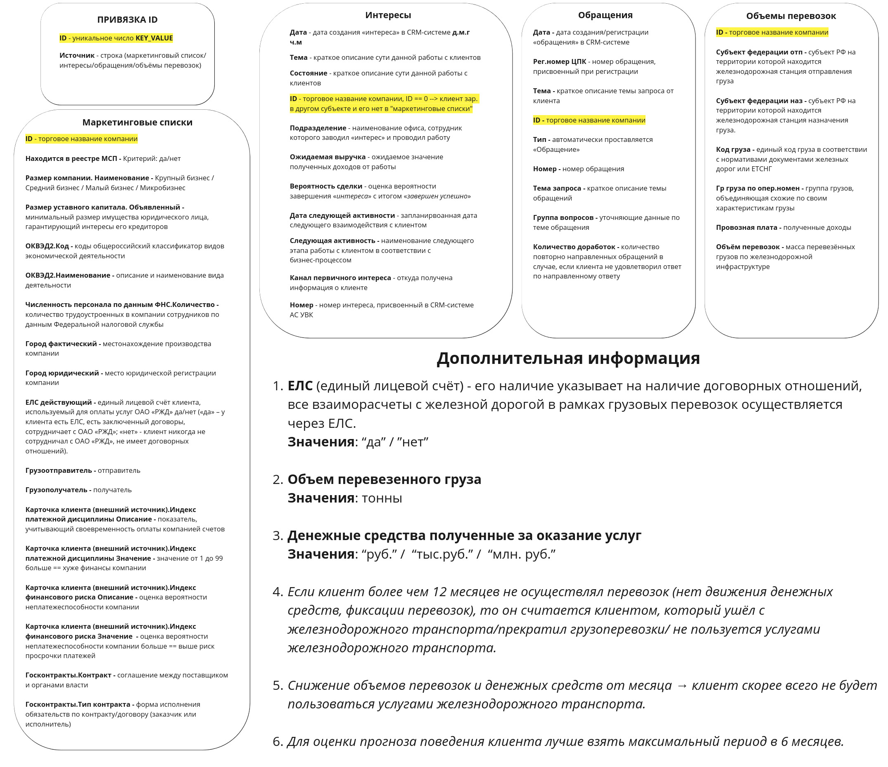

# Кейс от РЖД: Прогнозирование оттока клиентов

Наш проект решает задачу, поставленную в кейсе цифрового прорыва от РЖД по прогнозированию оттока клиентов компании и понижению спроса на услуги.

## Установка зависимостей
```bash
pip install -r requirements.txt
```
## Описание данных

Изначально нам были даны таблицы выгруженные из 1С по данным о клиентах из разных регионов.

## Схема данных

## Наше решение

1. **Разбили столлбцы на доп категории**: Выделили признаки важные в нешем решении.
2. **Аналитика**: Сделали аналитику по данным и выявили зависиимости.
3. **Добавление фичей**: Провели feature engeneering и добавили важные для нас характеристики.
4. **Проверка гипотез и использвание модели**: После необходимой обработки данных мы обучили модеель которая позволяет нам предсказывать вероятность ухода клиента.


## Использованные технологии
* **Pandas**: Для обработки данных.
* **Matplotlib / Plotly**: Визуализация полученных статистик.
* **Jupyter Notebook**: Интерактивная разработка и тестирование моделей.
* * **Streamlit**: Для хостинга решения и удобного использования.
 

## Описание файлов

| Нзавание                    | Описание                                                                         |
|------------------------------|---------------------------------------------------------------------------------|
| `requirements.txt`           | Файл с зависимостями проекта               |
| `Demonstration_of_download_data.ipynb`| Визуальное представление загруженных данных.                                 |
| `Demonstration_of_visual_functions.ipynb`           | Пример использования функций отрисовки графиков.                                 |
| `Demonstration_of_weights.ipynb`           | Демонстрация весов и важности параметров для модели.                                 |
| `StreamLit.zip`           | Стримлит готовый к использованию.                                 |
| `model_catboost.cbm`           | Обученная модель Catboost.                                 |


